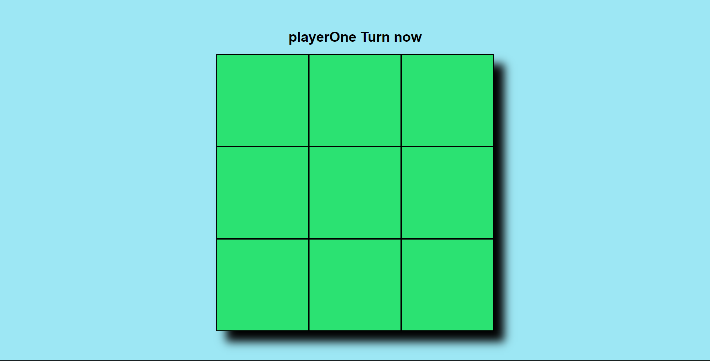
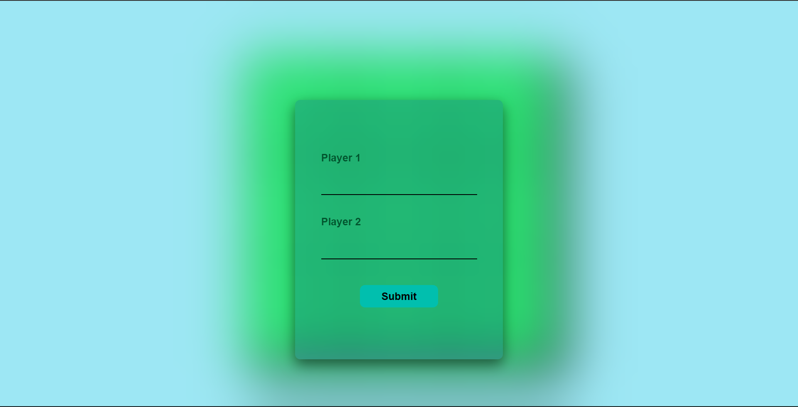

# Tic-Tac-Toe

A classic browser-based Tic-Tac-Toe game built with a focus on the **Module Pattern** and **IIFEs (Immediately Invoked Function Expressions)**. This project emphasizes clean, decoupled code and minimal global scope.

  
  

## 🚀 Live Demo
[Play Tic-Tac-Toe Here](https://codamee.github.io/tic-tac-toe/)

## 🎨 Key Features
* **Modular Architecture:** Organized into  modules (`gameBoard`, `gameController`, `screenUi`) to ensure game logic, data storage, and display rendering stay completely separate.
* **Coordinate-Based Win Logic:** Implemented a robust `winPatterns` array that evaluates 3x3 coordinate pairs after every move to detect winners or draws.
* **Custom Player Names:** Includes a pre-game setup modal where players can enter their names, which are then dynamically injected into the "Turn Tracker."
* **Smart UI Feedback:** Real-time "Referee" display that announces results and a blur-effect overlay for the game-start and game-end states.

## 🛠️ Technical Skills
* **Factory Functions & IIFEs:** Used the module pattern to create private state and public APIs, preventing global variable leakage and keeping the codebase maintainable.
* **Closure & State Management:** Leveraged closures within a `cell` factory to manage individual square values (0, X, or O) securely.
* **Event Delegation:** Optimized the UI by using a single event listener on the grid container to manage clicks across all 9 cells using `dataset` attributes.
* **Advanced Array Methods:** Extensively used `.some()`, `.every()`, and `.map()` to check game states and render the 2D grid array to the DOM.

---
*Built as part of The Odin Project JavaScript Path.*

